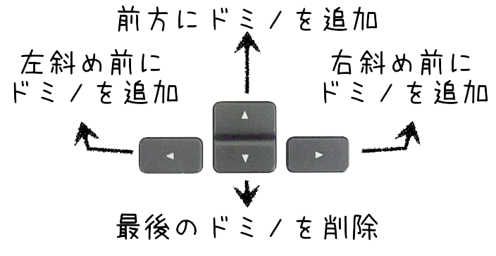

#onDetect
##遊び方
- 矢印キーを押して自由にARのドミノを配置します。
- 本物のドミノを最初のドミノに合わせて配置して倒してみましょう。
  

###補足
- start1 : ターミナルで`open -a Google\ Chrome --args -allow-file-access-from-files`+`Enter`
- start2 : index.htmlをドラッグ&ドロップ
- restart : リロード`Command+R`
- exit : ブラウザを閉じる
